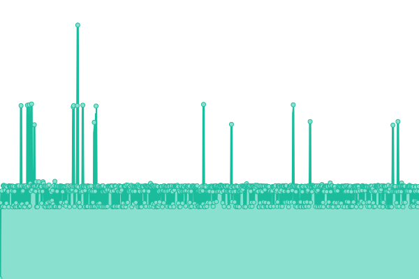
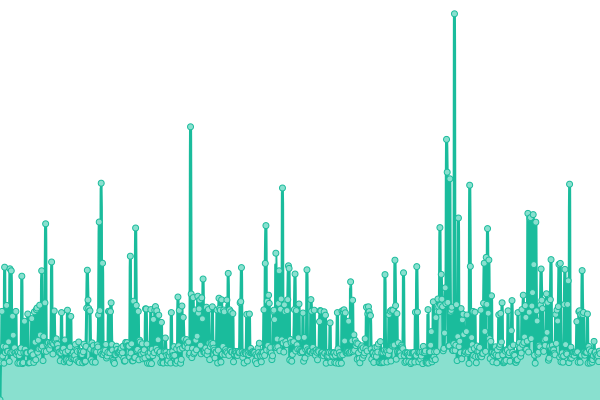

# [📈 Status](https://OJN666.github.io/server-status): <!--live status--> **🟧 Partial outage**

This repository contains the open-source uptime monitor and status page.

<!--start: status pages-->
<!-- This summary is generated by Upptime (https://github.com/upptime/upptime) -->
<!-- Do not edit this manually, your changes will be overwritten -->
<!-- prettier-ignore -->
| URL | Status | History | Response Time | Uptime |
| --- | ------ | ------- | ------------- | ------ |
|  PPDB-Marone | 🟩 Up | [ppdb-marone.yml](https://github.com/OJN666/server-status/commits/HEAD/history/ppdb-marone.yml) | 

 219ms
     
 | 

<a href="https://OJN666.github.io/server-status/history/ppdb-marone">47.66%</a>
    

|  Marone | 🟩 Up | [marone.yml](https://github.com/OJN666/server-status/commits/HEAD/history/marone.yml) | 

 218ms
     
 | 

<a href="https://OJN666.github.io/server-status/history/marone">0.00%</a>
    

|  PAS | 🟥 Down | [pas.yml](https://github.com/OJN666/server-status/commits/HEAD/history/pas.yml) | 

 227ms
     
 | 

<a href="https://OJN666.github.io/server-status/history/pas">99.97%</a>
    

|  Darkevo | 🟩 Up | [darkevo.yml](https://github.com/OJN666/server-status/commits/HEAD/history/darkevo.yml) | 

 264ms
     
 | 

<a href="https://OJN666.github.io/server-status/history/darkevo">100.00%</a>
    

<!--end: status pages-->

## 📄 License

- Powered by: [Upptime](https://github.com/upptime/upptime)
- Code: [MIT](./LICENSE) © [Anand Chowdhary](https://anandchowdhary.com), supported by [Pabio](https://pabio.com)
- Data in the `./history` directory: [Open Database License](https://opendatacommons.org/licenses/odbl/1-0/)
